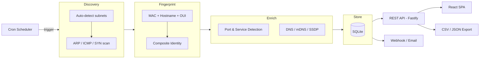

# 🔭 NetObserver — Network Observability

> Discover, fingerprint, and monitor all devices on your local network. Docker-based, zero-config startup.

## Features

- **Automatic device discovery** — ARP, ICMP, and TCP SYN scanning via nmap
- **Composite fingerprinting** — Persistent device identity across IP changes using MAC + hostname + vendor OUI + services + mDNS/SSDP
- **Scheduled & on-demand scans** — Configurable cron schedule with manual trigger support
- **Port & service detection** — Detect open ports, running services, and OS hints
- **DNS / mDNS / SSDP enrichment** — Resolve hostnames via reverse DNS, Bonjour, and UPnP
- **Alerting** — Webhook and email notifications for new/unknown devices
- **Device management** — Tag, name, merge/split device identities, mark devices as known
- **Historical tracking** — Full history of IP changes, port changes, and online/offline presence
- **Web dashboard** — Real-time overview, device list, charts, scan history
- **REST API** — Full CRUD with cursor-based pagination, filtering, sorting, and data export (CSV/JSON)
- **SQLite storage** — Embedded, zero-config database with WAL mode and configurable retention
- **Zero-config startup** — Auto-detects subnets, auto-generates API key on first run

## Quick Start

### Docker Compose (Recommended)

```bash
docker compose up -d
```

Then open [http://localhost:8080](http://localhost:8080)

### Docker Run

```bash
docker run -d \
  --name netobserver \
  --network host \
  --cap-add NET_RAW \
  --cap-add NET_ADMIN \
  -v netobserver-data:/data \
  netobserver
```

Retrieve your auto-generated API key:

```bash
docker exec netobserver cat /data/.api-key
```

## Configuration

### Environment Variables

| Variable | Type | Default | Description |
|----------|------|---------|-------------|
| `SCAN_SUBNETS` | Comma-separated | Auto-detected | Target subnets in CIDR notation (e.g., `192.168.1.0/24,10.0.0.0/24`) |
| `SCAN_CADENCE` | Cron string | `0 */6 * * *` | Scan schedule (every 6 hours by default) |
| `SCAN_INTENSITY` | Enum | `normal` | Scan depth: `quick`, `normal`, or `thorough` |
| `SCAN_PORT_RANGE` | String | `top1000` | Port range: `top1000`, `1-1024`, `1-65535`, or custom list |
| `STORAGE_RETENTION_DAYS` | Integer | `365` | Days to retain historical data (minimum 30) |
| `STORAGE_DB_PATH` | File path | `/data/network-observer.db` | SQLite database location |
| `ALERTS_ENABLED` | Boolean | `true` | Enable/disable alerting |
| `ALERT_COOLDOWN` | Integer | `3600` | Seconds between repeated alerts for the same device |
| `ALERT_WEBHOOK_URL` | Comma-separated | *(none)* | Webhook URLs for alert delivery |
| `ALERT_WEBHOOK_TIMEOUT` | Integer | `5000` | Webhook request timeout in ms |
| `ALERT_SMTP_HOST` | String | *(none)* | SMTP server hostname |
| `ALERT_SMTP_PORT` | Integer | `587` | SMTP server port |
| `ALERT_SMTP_USER` | String | *(none)* | SMTP username |
| `ALERT_SMTP_PASS` | String | *(none)* | SMTP password |
| `ALERT_EMAIL_FROM` | String | `noreply@network-observer` | Sender email address |
| `ALERT_EMAIL_TO` | Comma-separated | *(none)* | Recipient email addresses |
| `PRESENCE_OFFLINE_THRESHOLD` | Integer | `2` | Consecutive missed scans before marking a device offline |
| `PRESENCE_AVAILABILITY_WINDOW` | Integer | `24` | Hours used for availability percentage calculation |
| `API_PORT` | Integer | `8080` | HTTP server port |
| `API_KEY` | String | Auto-generated | API authentication key (omit to auto-generate on first run) |
| `LOG_LEVEL` | Enum | `info` | Log verbosity: `debug`, `info`, `warn`, `error` |
| `LOG_FORMAT` | Enum | `json` | Log format: `json` or `text` |
| `CONFIG_PATH` | File path | `/config/config.yaml` | Path to YAML configuration file |

### Config File (YAML)

Mount a YAML config file at `/config/config.yaml`:

```yaml
scan:
  subnets:
    - "192.168.1.0/24"
    - "10.0.0.0/24"
  cadence: "0 */4 * * *"
  intensity: "normal"
  port_range: "top1000"

storage:
  retention_days: 365

alerts:
  enabled: true
  cooldown_seconds: 3600
  webhook:
    urls:
      - "https://hooks.example.com/network-alerts"
  email:
    smtp_host: "smtp.example.com"
    smtp_port: 587
    smtp_user: "alerts@example.com"
    smtp_pass: "secret"
    from: "noreply@example.com"
    to:
      - "admin@example.com"

presence:
  offline_threshold: 2
  availability_window_hours: 24

api:
  port: 8080

logging:
  level: "info"
  format: "json"
```

### Configuration Precedence

```
defaults → config file → environment variables
```

Environment variables always win. The application runs with zero configuration out of the box — subnets are auto-detected and an API key is auto-generated on first run.

## API

### Authentication

All API endpoints require an `X-API-Key` header (except `GET /api/v1/docs`).

A key is auto-generated on first run and written to `/data/.api-key`.

### Endpoints

| Method | Path | Description |
|--------|------|-------------|
| `GET` | `/api/v1/health` | Health check |
| `GET` | `/api/v1/devices` | List devices (paginated, filterable, sortable) |
| `GET` | `/api/v1/devices/:id` | Get device detail |
| `PATCH` | `/api/v1/devices/:id` | Update display name, tags, notes, known flag |
| `GET` | `/api/v1/devices/:id/history` | Device history (IP, port, presence changes) |
| `POST` | `/api/v1/devices/:id/merge` | Merge two device identities |
| `POST` | `/api/v1/devices/:id/split` | Split a merged device identity |
| `GET` | `/api/v1/scans` | List scan history (paginated, date range filter) |
| `GET` | `/api/v1/scans/:id` | Get scan detail with device results |
| `GET` | `/api/v1/scans/current` | Current scan status (or null if idle) |
| `POST` | `/api/v1/scans` | Trigger manual scan (409 if already running) |
| `GET` | `/api/v1/tags` | List all tags with device counts |
| `POST` | `/api/v1/tags` | Create a new tag |
| `DELETE` | `/api/v1/tags/:id` | Delete a tag |
| `GET` | `/api/v1/stats/overview` | Dashboard overview metrics |
| `GET` | `/api/v1/stats/charts/device-count` | Device count time series |
| `GET` | `/api/v1/stats/charts/device-types` | Device type/vendor breakdown |
| `GET` | `/api/v1/export/devices` | Export devices (`?format=csv\|json`) |
| `GET` | `/api/v1/export/scans` | Export scans (`?format=csv\|json&from=&to=`) |
| `POST` | `/api/v1/config/reload` | Reload runtime-changeable config |
| `GET` | `/api/v1/docs` | OpenAPI/Swagger UI (no auth required) |

### Example Requests

**List devices:**

```bash
curl -H "X-API-Key: YOUR_KEY" http://localhost:8080/api/v1/devices
```

**Trigger a manual scan:**

```bash
curl -X POST -H "X-API-Key: YOUR_KEY" http://localhost:8080/api/v1/scans
```

**Export devices as CSV:**

```bash
curl -H "X-API-Key: YOUR_KEY" \
  "http://localhost:8080/api/v1/export/devices?format=csv" \
  -o devices.csv
```

## Device Fingerprinting

NetObserver builds a **composite fingerprint** for each device to maintain persistent identity across IP changes:

| Layer | Signal | Reliability |
|-------|--------|-------------|
| Primary | MAC address | High (wired); unreliable for MAC-randomizing mobile devices |
| Secondary | Hostname + Vendor OUI | Medium — stable hostnames help correlate |
| Tertiary | Open ports, services, mDNS/SSDP | Medium — characteristic service signatures |

**MAC randomization handling:** Randomized MACs are detected via the locally-administered bit. The system falls back to hostname + service fingerprint matching and flags potential duplicates for user review.

## Architecture



## Development

### Prerequisites

- Node.js 22+
- nmap installed (`brew install nmap` / `apt install nmap`)

### Setup

```bash
npm install
npm run dev
```

### Testing

```bash
npm test
```

### Project Structure

```
src/
  api/          # Fastify backend (routes, services, database)
  web/          # React SPA (Vite + Tailwind + Recharts)
  shared/       # Shared TypeScript types
specs/          # PRD, FRDs, Gherkin features, contracts
tests/          # BDD step definitions (Cucumber.js)
e2e/            # Playwright end-to-end tests
data/            # SQLite database (runtime)
```

## Docker Details

| Property | Value |
|----------|-------|
| Base image | `node:22-slim` + nmap via apt |
| Network | Host mode required for ARP scanning |
| Capabilities | `NET_RAW`, `NET_ADMIN` |
| Volume | `/data` for SQLite persistence |
| Config mount | `/config/config.yaml` (optional) |
| Health check | `GET /api/v1/health` |
| Build | Multi-stage: Vite builds frontend → served via `@fastify/static` |

## License

MIT
