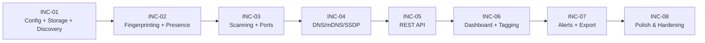

# Increment Delivery Plan

## Overview

This plan breaks the Network Observability application (13 features, F1–F13) into 8 ordered increments following a walking-skeleton-first approach. Each increment produces a deployable application with progressively richer functionality. The dependency graph flows from infrastructure (config, storage) → core pipeline (discovery, fingerprinting, scanning) → enrichment (ports, DNS) → access layer (API) → presentation (dashboard) → extensions (alerts, export, polish).

## Increment Summary

| ID | Name | Features | Complexity | Dependencies |
|----|------|----------|------------|--------------|
| INC-01 | Walking Skeleton — Config, Storage, Basic Discovery | F13, F4, F1 | High | None |
| INC-02 | Device Fingerprinting & Presence | F2, F8 | High | INC-01 |
| INC-03 | Scheduled Scanning & Port Detection | F3, F5 | High | INC-02 |
| INC-04 | DNS Resolution & Enrichment | F6 | Medium | INC-03 |
| INC-05 | REST API | F11 | High | INC-04 |
| INC-06 | Dashboard & Tagging | F10, F9 | High | INC-05 |
| INC-07 | Alerts & Export | F7, F12 | Medium | INC-06 |
| INC-08 | Polish & Hardening | — | Medium | INC-07 |

## Dependency Graph

---

## Detailed Increments

### INC-01: Walking Skeleton — Config, Storage, Basic Discovery

**Scope:** Establish the minimal end-to-end pipeline: the container starts, loads and validates configuration, initializes the SQLite database with the full schema, runs a single network scan to discover devices, and persists the raw results. This is the vertical slice proving the core data path works.

**Features:**
- F13 (Configuration Management): Layered config loader (env vars → config file → defaults), startup validation, subnet auto-detection from network interfaces, secret redaction in logs, API key generation
- F4 (Historical Data Storage): SQLite database initialization with WAL mode, full schema creation (`devices`, `scans`, `scan_results`, `device_history`, `device_tags`, `schema_migrations`, `tags`, `presence_events`), migration framework, retention cleanup job, indexing strategy
- F1 (Network Device Discovery): Subnet auto-detection, ARP scan, ICMP ping sweep, TCP SYN scan on common ports, result deduplication and merging across discovery methods, rate limiting, progress logging

**Screens:** None (backend-only increment)

**Flows:** None (no UI yet)

**Key Technical Tasks:**
1. Scaffold project structure: API service (Express.js), shared types, Dockerfile, Docker Compose with host networking
2. Implement layered configuration loader with environment variable and YAML/JSON file support
3. Add config validation (subnet CIDR format, retention range, scan interval, port ranges) with descriptive error messages on startup failure
4. Auto-detect subnets from container network interfaces when no manual subnet is configured
5. Generate and persist API key on first run
6. Initialize SQLite database with WAL journaling mode and all schema tables via migration framework
7. Create migration runner that tracks applied migrations in `schema_migrations`
8. Implement ARP scanner using raw sockets or nmap subprocess
9. Implement ICMP ping sweep scanner
10. Implement TCP SYN scanner for common ports discovery
11. Build result merger that deduplicates devices found by multiple methods (keyed on MAC address)
12. Persist scan metadata to `scans` table and per-device results to `scan_results`
13. Implement data retention cleanup as a scheduled job
14. Add health endpoint (`GET /api/v1/health`) returning application status and database connectivity
15. Write Dockerfile and Docker Compose configuration with host networking and persistent volume for SQLite

**Acceptance Criteria:**
- Container starts successfully with default configuration (no env vars or config file required)
- Config validation rejects invalid subnet CIDR formats, negative retention days, and invalid cron expressions at startup with descriptive error messages
- Subnets are auto-detected from network interfaces when not manually configured
- SQLite database is created at the configured path with all tables and indexes
- A scan can be triggered programmatically and discovers devices on the local subnet
- Discovered devices are persisted in `scan_results` with MAC, IP, and discovery method
- Scan metadata (start time, end time, device count, status) is recorded in `scans`
- Health endpoint returns 200 with `{ "status": "ok", "database": "connected" }`
- Retention cleanup removes records older than the configured period
- Application logs use structured JSON format with secret values redacted

**Dependencies:** None

**Complexity:** High — foundational infrastructure affecting all subsequent increments

---

### INC-02: Device Fingerprinting & Presence

**Scope:** Add persistent device identity across IP changes via composite fingerprinting, and track device online/offline presence over time. After this increment, devices are no longer ephemeral scan results — they have stable identities that survive DHCP changes and are tracked for availability.

**Features:**
- F2 (Device Fingerprinting & Identity): MAC-based primary identity, MAC normalization and randomization detection (locally-administered bit), OUI vendor lookup from IEEE database, composite fingerprint engine (MAC + hostname + OUI + services), confidence scoring, device merge and split operations, IP history tracking in `device_history`
- F8 (Online/Offline Presence Tracking): First-seen/last-seen timestamp management, presence state machine (online → offline transitions), configurable offline threshold (missed scans count), availability percentage calculation, presence event recording in `presence_events`

**Screens:** None (backend-only increment)

**Flows:** None (no UI yet)

**Key Technical Tasks:**
1. Create device identity service that resolves scan results to persistent device records using MAC matching
2. Implement MAC address normalization (case, delimiter, format) and locally-administered bit detection for randomization flagging
3. Bundle and index OUI vendor database (IEEE MA-L) for manufacturer lookup by MAC prefix
4. Build composite fingerprint engine combining MAC + hostname + vendor OUI with confidence scoring
5. Implement device merge operation: combine histories, tags, IPs, ports, and presence data from two device records into one
6. Implement device split operation: separate a merged device back into distinct records
7. Track IP address changes in `device_history` with old/new values and timestamps
8. Implement presence state machine: update `last_seen` on every scan sighting, increment `missed_scans` counter, transition to offline when threshold exceeded
9. Record presence state transitions (online→offline, offline→online) in `presence_events` table
10. Calculate availability percentage over configurable time ranges
11. Integrate fingerprinting and presence tracking into the post-scan pipeline (runs after every scan)

**Acceptance Criteria:**
- A device that changes IP address but keeps the same MAC is recognized as the same device with the new IP appended to its history
- MAC addresses with the locally-administered bit set are flagged as potentially randomized
- OUI lookup populates the vendor/manufacturer field for known MAC prefixes
- Device merge combines all history, tags, and metadata into the surviving record and removes the merged record
- Device split separates a previously merged record into two distinct devices
- `first_seen` is set once on initial discovery and never changes
- `last_seen` updates on every scan where the device is found
- A device not seen for N consecutive scans (configurable threshold) transitions to offline status
- Presence events are recorded with timestamps for every online↔offline transition
- Availability percentage is calculable for any time range

**Dependencies:** INC-01 (config, storage, discovery pipeline)

**Complexity:** High — identity resolution and state machine logic are core to the application's value

---

### INC-03: Scheduled Scanning & Port Detection

**Scope:** Automate scan execution on a configurable cron schedule and add detailed port/service detection to each scan. After this increment, the application runs autonomously — discovering devices, detecting their services, and recording everything on a schedule without manual intervention.

**Features:**
- F3 (Scheduled Scanning): Cron-based scheduler with configurable cadence (default: every 6 hours), scan lifecycle management (pending → in-progress → completed/failed), scan overlap prevention via locking, manual scan trigger capability, configurable scan intensity profiles (light/standard/full), startup scan option, scan history with full metadata
- F5 (Port & Service Detection): TCP port scanning on configurable port ranges (default: top 1000), UDP port scanning for common services, banner grabbing for service identification, service version detection, port state change tracking (open→closed, closed→open) in device history

**Screens:** None (backend-only increment)

**Flows:** None (no UI yet — but manual scan trigger via internal API prepares for INC-05)

**Key Technical Tasks:**
1. Implement cron scheduler using node-cron or similar library, driven by config cadence
2. Add scan lock mechanism (database-backed or in-memory mutex) to prevent overlapping scans
3. Implement scan lifecycle state machine: pending → in-progress → completed/failed with timestamps
4. Add manual scan trigger (internal function, exposed via API in INC-05)
5. Define scan intensity profiles: Light (ARP only, fast), Standard (ARP + ICMP + top 100 ports), Full (ARP + ICMP + top 1000 ports + service detection)
6. Implement TCP port scanner with configurable port ranges
7. Implement UDP port scanner for common service ports (DNS/53, DHCP/67-68, SNMP/161, mDNS/5353)
8. Add banner grabbing: connect to open ports and capture service banners
9. Implement service/version detection from banner analysis and known port mappings
10. Track port state changes in `device_history`: record when ports open or close between scans
11. Store per-device port results in `scan_results.open_ports` as structured data
12. Add startup scan option (configurable: run a scan immediately on application start)
13. Integrate port scanning into the post-discovery pipeline (runs per device after discovery)

**Acceptance Criteria:**
- With default config, scans run automatically every 6 hours
- Custom cron expressions (e.g., `0 */4 * * *`) are correctly parsed and scheduled
- If a scan is already running, a second trigger is rejected with a clear status response
- Scan records include: start time, end time, duration, devices found, new devices, errors, status
- TCP port scanning detects open ports and identifies common services (SSH, HTTP, HTTPS, SMB, etc.)
- Port state changes between scans are recorded in device history with timestamps
- Scan intensity profiles affect the depth and duration of scans as configured
- A startup scan runs immediately when the application starts (if configured)
- Banner grabbing populates service name and version for open ports

**Dependencies:** INC-02 (fingerprinting for device identity during scans, presence tracking)

**Complexity:** High — scheduler reliability and port scanning depth are critical for autonomous operation

---

### INC-04: DNS Resolution & Enrichment

**Scope:** Enrich discovered devices with name resolution from DNS, mDNS (Bonjour/Avahi), and SSDP (UPnP). After this increment, devices have human-readable names and discovered service announcements beyond raw port data.

**Features:**
- F6 (DNS/mDNS/SSDP Resolution): Reverse DNS (PTR) lookup for all discovered IPs, mDNS/Bonjour service browser and query, SSDP/UPnP device discovery via M-SEARCH, DNS result caching with configurable TTL, name prioritization logic (user-assigned > mDNS > DNS > hostname > MAC), enrichment pipeline integration with fingerprinting engine

**Screens:** None (backend-only increment)

**Flows:** None (no UI yet)

**Key Technical Tasks:**
1. Implement reverse DNS (PTR) resolver for discovered IP addresses with timeout handling
2. Implement mDNS service browser using multicast DNS (port 5353) to discover Bonjour services
3. Implement mDNS query for specific device names (`.local` domain)
4. Implement SSDP discovery via UDP multicast M-SEARCH on 239.255.255.250:1900
5. Parse SSDP device description XML for friendly name, manufacturer, model
6. Build DNS/mDNS/SSDP result cache with configurable TTL to avoid redundant lookups between scans
7. Implement name prioritization: user display name > mDNS service name > reverse DNS > DHCP hostname > MAC address
8. Store resolved names in `scan_results` fields: `dns_names`, `mdns_names`, `ssdp_info`
9. Feed DNS/mDNS/SSDP data into the fingerprinting engine as tertiary identity signals
10. Add cache clear endpoint (internal, exposed via API in INC-05) for manual cache invalidation
11. Handle resolver errors gracefully: timeouts, NXDOMAIN, unreachable DNS servers

**Acceptance Criteria:**
- Reverse DNS resolves PTR records for devices and stores them in the device profile
- mDNS discovery finds Bonjour-announcing devices (e.g., Apple TV, printers) with their service names
- SSDP discovery finds UPnP devices (e.g., smart speakers, media servers) with their friendly names
- DNS/mDNS/SSDP results are cached and reused across scans until TTL expires
- Name prioritization correctly prefers user-assigned names over all automated sources
- Resolved names are fed into the composite fingerprint for identity matching
- Resolver failures (timeouts, NXDOMAIN) are handled gracefully without blocking the scan pipeline
- Cache can be cleared programmatically

**Dependencies:** INC-03 (scanning pipeline to trigger enrichment, port data for service correlation)

**Complexity:** Medium — protocol implementations are well-defined but involve UDP multicast and XML parsing

---

### INC-05: REST API

**Scope:** Expose all backend data and operations through a versioned REST API with authentication, pagination, filtering, and OpenAPI documentation. After this increment, all application functionality is accessible programmatically, forming the contract between backend and frontend.

**Features:**
- F11 (REST API): Full endpoint suite under `/api/v1/` — devices (list, detail, update, merge, history), tags (CRUD), scans (list, detail, trigger, current status), stats (overview, charts), export (devices, scans), config (reload), cache (clear), docs (OpenAPI). API key authentication middleware. Cursor-based pagination for list endpoints. Filter and sort query parameters. Rate limiting (100 req/min). Consistent JSON response envelope. OpenAPI/Swagger specification and interactive docs UI.

**Screens:** OpenAPI/Swagger documentation UI at `/api/v1/docs`

**Flows:** None (API-only, but enables all subsequent UI flows)

**Key Technical Tasks:**
1. Set up Express.js router with `/api/v1/` prefix and versioning
2. Implement API key authentication middleware (validates `X-API-Key` header or `api_key` query param)
3. Implement rate limiting middleware (configurable, default 100 requests/minute per key)
4. Build consistent JSON response envelope: `{ "data": ..., "pagination": ..., "meta": ... }`
5. **Device endpoints:** `GET /devices` (paginated, filterable by tag/status/vendor, sortable), `GET /devices/:id` (full detail with identity, IPs, ports, presence), `PATCH /devices/:id` (update display name, notes, known flag), `GET /devices/:id/history` (IP changes, port changes, presence events with date range), `POST /devices/:id/merge` (merge two devices), `POST /devices/bulk-tag` (bulk add/remove tags)
6. **Tag endpoints:** `GET /tags` (list all), `POST /tags` (create), `PATCH /tags/:id` (rename), `DELETE /tags/:id` (remove from all devices)
7. **Scan endpoints:** `GET /scans` (paginated with date range filter), `GET /scans/:id` (detail with per-device results), `GET /scans/current` (active scan progress), `POST /scans` (trigger manual scan)
8. **Stats endpoints:** `GET /stats/overview` (total devices, new devices 24h, offline count, last scan), `GET /stats/charts/device-count` (time series), `GET /stats/charts/device-types` (vendor/type breakdown)
9. **Export endpoints:** `GET /export/devices` (CSV/JSON with filter params), `GET /export/scans` (CSV/JSON with date range)
10. **Config endpoints:** `POST /config/reload` (hot-reload configuration)
11. **Cache endpoints:** `POST /cache/clear` (invalidate DNS/mDNS/SSDP cache)
12. Implement cursor-based pagination with `limit` and `cursor` parameters
13. Implement filter parsing: tag (multi-select OR), status (online/offline), vendor (text match), date ranges
14. Implement sort parsing: field + direction (e.g., `sort=last_seen&order=desc`)
15. Generate OpenAPI 3.0 specification from route definitions
16. Serve Swagger UI at `/api/v1/docs` using swagger-ui-express
17. Add request validation middleware for body/query schemas
18. Add structured error responses: `{ "error": { "code": "...", "message": "..." } }`

**Acceptance Criteria:**
- All endpoints require a valid API key; requests without one return 401 Unauthorized
- `GET /api/v1/devices` returns a paginated list with correct cursor-based pagination
- Device list supports filtering by tag, status, vendor, and text search
- `POST /api/v1/scans` triggers a manual scan and returns the scan ID (or 409 if scan is in progress)
- `GET /api/v1/scans/current` returns progress data for an active scan or 404 if none
- `PATCH /api/v1/devices/:id` updates display name, notes, and known flag
- `POST /api/v1/devices/:id/merge` merges two device identities
- `GET /api/v1/export/devices?format=csv` returns a CSV download with correct Content-Disposition header
- OpenAPI documentation is served at `/api/v1/docs` and accurately describes all endpoints
- Rate limiting returns 429 Too Many Requests when threshold is exceeded
- All error responses use the consistent error envelope format

**Dependencies:** INC-04 (all data layers must exist: devices, fingerprints, scans, ports, DNS, presence)

**Complexity:** High — large endpoint surface area with auth, pagination, filtering, and documentation

---

### INC-06: Dashboard & Tagging

**Scope:** Build the complete web-based UI: overview dashboard with metric cards and charts, device list with search/filter/sort, device detail with tabbed views (history, ports, presence, tags), scan history, and settings page. Also implement the tagging system that the UI depends on for device organization.

**Features:**
- F10 (Dashboard & Visualization): Overview dashboard with metric cards (total devices, new 24h, offline, last scan), scan progress banner, recent activity feed, network summary charts (device count over time, vendor breakdown), device list with search/filter/sort/pagination, device detail with tabbed views (Overview, History, Ports & Services, Presence, Tags & Notes), scan history with expandable detail rows, settings page (scanning, retention, alerts, API tabs), responsive layout for desktop and tablet
- F9 (Device Tagging & Naming): Tag CRUD operations, tag display as chips/pills, typeahead tag input with suggestions, bulk tagging from device list, default suggested tags seeding, display name inline editing, notes editor with markdown support, tag filtering in device list

**Screens:** Dashboard (Home), Device List, Device Detail, Scan History, Settings, Active Scan Progress (modal), Device Merge (modal), Alerts Log

**Flows:**
- Flow 1: First-Run Experience
- Flow 2: Browse and Search Devices
- Flow 3: View Device Details
- Flow 4: Tag Multiple Devices
- Flow 5: Trigger Manual Scan
- Flow 6: Configure Scan Settings
- Flow 9: View Scan History
- Flow 10: Device Identity Merge

**Key Technical Tasks:**
1. Scaffold Next.js web application with app router and responsive layout shell (sidebar nav + main content)
2. Build sidebar navigation component with links: Dashboard, Devices, Scans, Alerts, Settings — with active state highlighting
3. **Dashboard page:** Metric cards (total, new, offline, last scan) polling `/api/v1/stats/overview`, scan progress banner polling `/api/v1/scans/current`, recent activity feed, device count line chart (7d/30d/90d/1y), vendor breakdown donut chart, "Scan Now" button with confirmation modal, empty state for first-run
4. **Device List page:** Search bar with real-time filtering, filter bar (tag multi-select, status dropdown, vendor typeahead, first-seen date range), sortable device table, bulk action toolbar (tag, mark known/unknown), pagination, export buttons (CSV/JSON), checkbox selection
5. **Device Detail page:** Identity card header with inline-editable display name, known/unknown toggle, tab bar (Overview, History, Ports & Services, Presence, Tags & Notes), IP history table, port change log, presence timeline chart, tag editor with typeahead, notes editor, merge button, breadcrumb navigation back to device list
6. **Scan History page:** Scan list table with expandable detail rows, date range filter, export buttons, active scan indicator, pagination
7. **Settings page:** Tabbed form (General/Network/Alerts/API), scan cadence dropdown, intensity radio group, retention days input, subnet management, webhook URL with test button, email SMTP configuration, API key display/reveal/copy/regenerate
8. **Device Merge modal:** Source/target device selector, side-by-side preview, confirmation dialog
9. **Scan Progress modal/banner:** Progress bar, live device feed, dismiss/cancel options
10. Implement tag CRUD: create tags, delete tags, apply/remove tags from devices
11. Implement bulk tagging: multi-select devices → apply/remove tag in one operation
12. Seed default suggested tags (e.g., "IoT", "Server", "Printer", "Mobile", "Infrastructure")
13. Build tag typeahead input with suggestion dropdown
14. Implement display name inline editing with save on blur/enter
15. Implement notes editor with character count and auto-save
16. Add responsive breakpoints: desktop (1024px+), tablet (768–1023px with collapsed sidebar)
17. Integrate Aspire orchestration for API + Web service wiring

**Acceptance Criteria:**
- Dashboard displays correct metric card values sourced from the API
- Scan progress banner appears during active scans and updates via polling
- Device list search filters across name, MAC, IP, hostname, vendor, and tags in real-time
- Filters (tag, status, vendor, date range) narrow the device list correctly with AND logic
- Device detail tabs all render correct data from the API
- Inline display name editing saves to the API and updates the UI
- Tag typeahead suggests existing tags and allows creating new ones
- Bulk tagging applies a tag to all selected devices in one operation
- Scan history shows expandable rows with per-device results
- Settings page allows modifying scan cadence, retention, alert config, and API key
- Device merge modal shows a preview and completes the merge successfully
- Layout is responsive: sidebar collapses to icons on tablet widths
- All interactive elements have `data-testid` attributes matching the component inventory

**Dependencies:** INC-05 (REST API provides all data endpoints the UI consumes)

**Complexity:** High — largest increment by surface area, but all backend work is done; this is UI assembly

---

### INC-07: Alerts & Export

**Scope:** Add new-device alerting via webhooks and email, and implement data export functionality in both the API and UI. After this increment, the application has its complete feature set.

**Features:**
- F7 (New Device Alerts): New device detection by comparing scan results against known device list, webhook delivery (HTTP POST with device details payload), email delivery via SMTP, configurable cooldown period (default 1 hour) to prevent duplicate alerts, alert retry queue for failed deliveries, "known" device flag to suppress alerts, alert audit logging, alert history storage
- F12 (Data Export): CSV export for devices and scans (streaming for large datasets), JSON export for devices and scans, filename generation with timestamps, Content-Disposition header for browser downloads, filter-aware exports (respects active filters/date ranges), export via API endpoints and UI download buttons

**Screens:** Alerts Log page, export buttons on Device List and Scan History (already scaffolded in INC-06)

**Flows:**
- Flow 7: Set Up Webhook Alerts
- Flow 8: Export Device Data

**Key Technical Tasks:**
1. Implement new-device detection: after each scan, compare discovered MACs against existing device records to identify first-time appearances
2. Build webhook delivery service: HTTP POST to configured URL with JSON payload (device MAC, IP, vendor, hostname, services, timestamp)
3. Build email delivery service: SMTP client sending formatted alert emails to configured recipients
4. Implement cooldown logic: track last alert time per device, skip if within cooldown period
5. Implement retry queue: failed webhook/email deliveries are retried with exponential backoff (max 3 retries)
6. Add "known" device flag: devices marked as known do not trigger new-device alerts on reappearance
7. Store alert history: timestamp, type, device, delivery method, status (sent/failed/pending), response details
8. Add webhook test endpoint: send a test payload to verify webhook URL works
9. Add email test endpoint: send a test email to verify SMTP configuration
10. Implement CSV export service: streaming CSV writer for devices and scans with proper headers and escaping
11. Implement JSON export service: streaming JSON array writer for large datasets
12. Generate filenames with timestamps (e.g., `devices_2024-01-15_14-30-00.csv`)
13. Set Content-Disposition header for browser download triggers
14. Apply current filters to exports: tag, status, vendor, date range parameters flow through to export queries
15. Build Alerts Log UI page: table with timestamp, type, device link, delivery method, status; filter by type/status/date; expandable rows for delivery details; retry button for failed alerts
16. Wire export buttons in Device List and Scan History pages to API export endpoints

**Acceptance Criteria:**
- When a previously unseen device is discovered, a webhook POST is sent to the configured URL within 30 seconds
- Webhook payload includes: MAC, IP, vendor, hostname, discovered services, scan timestamp
- Email alerts are sent via configured SMTP server with device details
- Cooldown prevents duplicate alerts: a device alerted within the cooldown period does not trigger another alert
- Failed deliveries are retried up to 3 times with backoff
- Devices marked as "known" do not trigger new-device alerts
- Alert history is viewable on the Alerts Log page with filtering
- Test webhook/email buttons verify delivery configuration
- CSV export downloads a valid CSV file with all expected columns
- JSON export returns a valid JSON array
- Exports respect active filters and date ranges
- Exports work from both UI buttons and API endpoints
- Large exports (1000+ devices) stream without memory issues

**Dependencies:** INC-06 (Dashboard UI for export buttons and alerts log page, known-device flag in device detail)

**Complexity:** Medium — well-defined integrations (HTTP webhook, SMTP, CSV/JSON serialization) with clear boundaries

---

### INC-08: Polish & Hardening

**Scope:** Production readiness: automated data retention cleanup, comprehensive error handling, performance optimization for large networks (500+ devices), documentation, and operational polish. No new features — this increment hardens what exists.

**Features:** No new features. Cross-cutting improvements to all existing features.

**Screens:** All screens (error states, loading states, edge case handling)

**Flows:** All flows (error paths, edge cases, performance under load)

**Key Technical Tasks:**
1. Harden data retention cleanup: ensure scheduled cleanup handles large datasets efficiently, add logging for deleted record counts, handle edge cases (empty database, corrupt records)
2. Add comprehensive error handling throughout the scan pipeline: network timeouts, permission errors, nmap failures, database write errors — all with structured logging and graceful degradation
3. Optimize database queries for large networks: add missing indexes, analyze query plans for device list/history/stats endpoints, implement query result caching for expensive aggregations
4. Optimize scan performance: parallel device scanning, connection pooling, configurable concurrency limits
5. Add loading states and skeleton screens to all UI pages
6. Add error boundary components with user-friendly error messages and retry options
7. Add empty states for all list views (no devices, no scans, no alerts, no tags)
8. Handle API timeout and error responses gracefully in the UI with toast notifications
9. Add application startup self-test: verify database connectivity, network access, nmap availability
10. Add structured logging throughout: request/response logging, scan pipeline events, error details
11. Write operational documentation: deployment guide, configuration reference, API usage examples, troubleshooting guide
12. Add Docker health check in Dockerfile using the `/api/v1/health` endpoint
13. Optimize Docker image size: multi-stage build, minimal base image, security hardening
14. Test with large datasets: 500+ devices, 1000+ scans, verify pagination and chart performance
15. Add graceful shutdown handling: complete in-progress scans, close database connections, flush logs

**Acceptance Criteria:**
- Retention cleanup runs on schedule and correctly deletes only records older than the configured period
- Scan pipeline handles network errors (timeouts, unreachable hosts, DNS failures) without crashing
- Database queries for 500+ devices complete within 200ms for list endpoints
- UI displays appropriate loading, empty, and error states for all views
- Application starts up and runs the self-test, logging any issues
- Docker health check correctly reports healthy/unhealthy status
- Documentation covers deployment, configuration, API usage, and troubleshooting
- Application handles graceful shutdown without data corruption
- Docker image is optimized (minimal size, non-root user, read-only filesystem where possible)

**Dependencies:** INC-07 (complete feature set must be in place before hardening)

**Complexity:** Medium — breadth of changes but each is well-scoped and testable independently

---

## Extension Follow-up — Device List & Detail Corrections (2026-04)

These extensions append to the existing product plan and target gaps discovered during live usage after the port-scanning fixes. They are ordered so status correctness lands before any UI work that depends on trustworthy presence data.

### ext-pre-001: Reconcile Presence Truth Model & Device Status Contract

- **Type:** extension-prerequisite
- **FRD:** frd-device-list-status.md
- **Scope:** Align the persisted device status model with the presence feature so device list filtering, offline counts, and detail views stop relying on a scan upsert that only forces devices online. Extend the device/status API contract to expose a presence-driven status enum while keeping a backward-compatible derived `isOnline` boolean for existing callers.
- **Acceptance Criteria:**
  - [ ] Devices transition to `offline` after the configured missed-scan threshold and remain queryable through `/api/v1/devices?status=offline`
  - [ ] `GET /api/v1/stats/overview` offline counts match the offline device list
  - [ ] Device responses expose a richer status contract without breaking current consumers that still read `isOnline`
  - [ ] Known/new lifecycle state no longer overrides connectivity truth
- **Test Strategy:**
  - Unit tests for persisted presence-state reconciliation and scan-completion transitions
  - API integration tests for `/devices` and `/stats/overview` status filtering/counts
  - E2e regression covering offline filter behavior from the Device List page
- **Gherkin Deltas:**
  - Modified: `Scenario: Device goes offline after exceeding missed scan threshold` — status must be reflected in persisted device queries, not just tracker helpers
  - Modified: `Scenario: Device list filters by online/offline status` — offline filter must return real offline devices and match overview counts
  - Modified: `Scenario: GET /api/v1/devices with status filter for online devices` — API contract now includes presence-backed status semantics
  - New: `Scenario: GET /api/v1/devices with status filter for offline devices`
  - Regression: existing presence transition, device detail identity, and dashboard metric scenarios remain green
- **Integration Points:**
  - `src/api/routes/scans.ts`
  - `src/api/routes/devices.ts`
  - `src/api/routes/stats.ts`
  - `src/api/presence/tracker.ts`
  - `src/web/components/StatusBadge.tsx`
- **Dependencies:** none
- **Rollback Plan:** Revert schema/API contract changes and fall back to the previous `is_online`-only behavior
- **Complexity:** High

### ext-001: Fix Device List Status Presentation

- **Type:** extension
- **FRD:** frd-device-list-status.md
- **Scope:** Update the Device List UI so the Status column represents connectivity only, using green/red/amber semantics, and move "new/known" signaling out of the status dot. Ensure the status chips and row badges stay consistent with the reconciled backend contract.
- **Acceptance Criteria:**
  - [ ] The Status column renders green for online, red for offline, and amber for unknown
  - [ ] A device marked as new no longer appears with a purple status dot when it is actually online or offline
  - [ ] Offline-filtered results show matching red status indicators throughout the visible table
  - [ ] Known/new lifecycle state remains visible elsewhere in the row or detail flow without overloading the status column
- **Test Strategy:**
  - Component tests for `StatusBadge` and `DeviceTable`
  - UI integration tests for filter chips + rendered badge states
  - E2e regression for Device List browsing and row inspection
- **Gherkin Deltas:**
  - Modified: `Scenario: Device list displays all discovered devices` — row status now reflects connectivity-only semantics
  - Modified: `Scenario: Device list filters by online/offline status` — filtered rows show matching badge colors and labels
  - Regression: search, sorting, and navigation scenarios remain unchanged
- **Integration Points:**
  - `src/web/components/DeviceTable.tsx`
  - `src/web/components/StatusBadge.tsx`
  - `src/web/pages/DeviceListPage.tsx`
  - `e2e/device-list.spec.ts`
- **Dependencies:** ext-pre-001
- **Rollback Plan:** Restore prior badge mapping if the new semantics break existing list interactions
- **Complexity:** Medium

### ext-002: Add Configurable Device List Page Size

- **Type:** extension
- **FRD:** frd-device-list-status.md
- **Scope:** Add a rows-per-page control to the Device List with `10`, `25`, `50`, `100`, and `All` options. Persist the chosen value and active sort client-side, restore them after returning from device detail, and support fetching the full filtered dataset when `All` is selected.
- **Acceptance Criteria:**
  - [ ] The Device List exposes exactly the five approved rows-per-page options
  - [ ] First-visit behavior defaults to 50 rows sorted by IP address ascending
  - [ ] Changing the page size updates visible rows and pagination copy immediately
  - [ ] Selecting `All` returns the full filtered result set rather than the first API page only
  - [ ] Search, filter, and sort choices survive page-size changes
  - [ ] Rows-per-page and sort choices are restored after drilling into device detail and returning
- **Test Strategy:**
  - Component tests for pagination controls and page-size state
  - API-client tests for multi-page/full-result retrieval behavior
  - E2e regression for rows-per-page selection and pagination copy
- **Gherkin Deltas:**
  - New: `Scenario: Device list page size is configurable`
  - Modified: `Scenario: GET /api/v1/devices returns paginated device list` — device retrieval must support the approved page-size options without truncation
  - Modified: `Scenario: Pagination includes cursor metadata` — metadata remains correct while supporting 100-row and all-result retrieval
  - Regression: existing search and filter scenarios remain green across all supported page sizes
- **Integration Points:**
  - `src/web/pages/DeviceListPage.tsx`
  - `src/web/components/DeviceTable.tsx`
  - `src/web/api-client.ts`
  - `src/api/routes/devices.ts`
- **Dependencies:** ext-pre-001, ext-001
- **Rollback Plan:** Remove the selector and restore the fixed 10-row client pagination if full-result retrieval proves unstable
- **Complexity:** Medium

### ext-003: Rationalize Device Detail History into an Activity Tab

- **Type:** extension
- **FRD:** frd-device-detail-activity.md
- **Scope:** Replace the overlapping IP History and Presence tabs with a single Activity tab that combines current presence summary, populated IP history, and a chronological event feed for IP and online/offline changes. Upgrade the history API contract so the frontend receives structured sections instead of raw history rows.
- **Acceptance Criteria:**
  - [ ] Device detail navigation becomes `Overview`, `Activity`, `Ports & Services`, and `Tags & Notes`
  - [ ] The Activity tab shows populated IP history and presence events when data exists
  - [ ] Devices without history still show meaningful empty states rather than a broken-looking blank table
  - [ ] The history API returns structured sections that match the typed frontend contract
- **Test Strategy:**
  - API integration tests for structured `/devices/:id/history` payloads
  - Component tests for Activity tab states with full, partial, and empty history
  - E2e regression for device-detail tab navigation
- **Gherkin Deltas:**
  - Modified: `Scenario: Device detail shows IP history tab` — replaced by an Activity tab that includes IP history plus presence events
  - New: `Scenario: Device detail activity tab shows IP changes and online/offline transitions`
  - Modified: `Scenario: GET /api/v1/devices/:id/history returns device history` — response shape changes from raw entries to structured sections
  - Regression: device identity, ports tab, and tag-editing scenarios remain green
- **Integration Points:**
  - `src/web/pages/DeviceDetailPage.tsx`
  - `src/web/api-client.ts`
  - `src/api/routes/devices.ts`
  - `e2e/device-detail.spec.ts`
- **Dependencies:** ext-pre-001
- **Rollback Plan:** Restore separate IP History and Presence tabs if structured history aggregation proves too disruptive
- **Complexity:** Medium

### ext-004: Simplify Ports & Services Table Presentation

- **Type:** extension
- **FRD:** frd-device-detail-activity.md
- **Scope:** Remove the standalone Version column from the Ports & Services table and render version information only as secondary service detail when real values exist. Keep the backend/API `version` field intact so service-version detection remains available for future advanced views and exports.
- **Acceptance Criteria:**
  - [ ] The Ports & Services table renders `Port`, `Protocol`, and `Service` as its primary columns
  - [ ] Version data appears inline with service information only when present
  - [ ] Devices without version data do not show empty placeholder-only columns
  - [ ] Service-version parsing remains available in the API and underlying scan results
- **Test Strategy:**
  - Component tests for ports table rendering with and without version values
  - E2e regression for Device Detail ports view
  - Unit regression for service-version extraction/parsing
- **Gherkin Deltas:**
  - Modified: `Scenario: Device detail shows ports tab` — table assertions now target the simplified column set
  - Regression: `Scenario: Service version detection from banner` remains unchanged because parsing support stays in the backend contract
- **Integration Points:**
  - `src/web/pages/DeviceDetailPage.tsx`
  - `src/shared/types/device.ts`
  - `src/api/routes/devices.ts`
  - `src/api/scanner/ports.ts`
- **Dependencies:** ext-003
- **Rollback Plan:** Restore the Version column if inline service metadata proves insufficient for operational use
- **Complexity:** Low
