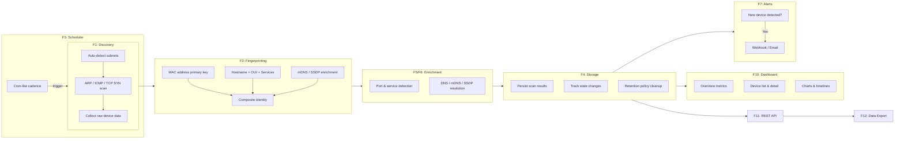

# Product Requirements Document — Network Observability

## Product Vision

A Docker-based network observability application that runs on a user's local network, automatically discovers devices, fingerprints them for persistent identity tracking, collects network data on a configurable schedule, stores historical data, and provides a web-based visualization dashboard.

## Product/Process Diagram

## User Personas

### Home Network Admin
Wants visibility into what's on their home network, track device history, and get alerts when new devices appear. Values simplicity — expects the tool to work out of the box with minimal configuration.

### Small Business IT
Needs to inventory network devices, track changes over time, and export reports for compliance or auditing. Values reliability, data retention, and export capabilities.

### Security-Conscious User
Wants to detect unauthorized devices, monitor open ports and services, and receive immediate alerts for unknown devices. Values thorough scanning, fingerprint accuracy, and alert timeliness.

---

## Device Fingerprinting Strategy

Devices on local networks frequently change IP addresses (DHCP lease renewal, reconnections). A robust identity model is essential to track devices persistently across IP changes.

### Composite Fingerprint Approach

| Layer | Signal | Purpose | Reliability |
|-------|--------|---------|-------------|
| **Primary** | MAC address | Unique hardware identifier | High for wired/static devices; unreliable for MAC-randomizing mobile devices |
| **Secondary** | Hostname pattern | Device-reported name via DHCP/mDNS | Medium — some devices use stable hostnames |
| **Secondary** | Vendor OUI | IEEE-registered manufacturer prefix (first 3 octets of MAC) | High — helps classify device type |
| **Tertiary** | Open ports & services | Characteristic service signatures (e.g., port 631 = printer) | Medium — services can change |
| **Tertiary** | mDNS/SSDP announcements | Bonjour service names, UPnP device descriptions | Medium — only for announcing devices |

### Identity Resolution Rules

1. **MAC match** — If a device's MAC matches a known device, merge into existing identity regardless of IP change.
2. **Fingerprint correlation** — If MAC is new (possible randomization), compare hostname + OUI + service profile against known devices. If similarity exceeds a configurable threshold, suggest merge (or auto-merge if confidence is high).
3. **Manual override** — Users can always manually merge or split device identities when automatic detection fails.
4. **IP history** — Every IP address a device has used is recorded in its history, enabling tracking across DHCP changes.

### MAC Randomization Handling

Modern mobile devices (iOS, Android) randomize MAC addresses per network. The system handles this by:

- Detecting randomized MACs via the locally-administered bit (second nibble is 2, 6, A, or E).
- Falling back to hostname + service fingerprint matching for randomized MACs.
- Flagging potential duplicates for user review when confidence is below threshold.

---

## Features

### F1: Network Device Discovery

**Description:** Scan configurable subnets using nmap-like capabilities to discover all devices on the local network.

**Requirements:**

| ID | Requirement | Priority |
|----|-------------|----------|
| F1.1 | Discover devices via ARP scan on local subnets | Must |
| F1.2 | Discover devices via ICMP echo (ping sweep) | Must |
| F1.3 | Discover devices via TCP SYN scan on common ports | Must |
| F1.4 | Auto-detect local subnets from the container's network interfaces | Must |
| F1.5 | Support manual subnet configuration override (single or multiple subnets) | Must |
| F1.6 | Support IPv4 networks | Must |
| F1.7 | Discovery must be thorough but not disruptive to network operations | Must |
| F1.8 | Combine results from all discovery methods into a unified device list | Must |

**Acceptance Criteria:**

- Given the application is running in Docker with host networking, when a scan is triggered, then all active devices on configured subnets are discovered within the performance target.
- Given no manual subnet is configured, when the application starts, then it auto-detects subnets from the container's network interfaces.
- Given manual subnets are configured, when a scan runs, then only the configured subnets are scanned (overriding auto-detection).
- Given a device responds to only one discovery method (e.g., ARP but not ICMP), when scan completes, then the device still appears in results.

---

### F2: Device Fingerprinting & Identity

**Description:** Build a composite fingerprint for each discovered device to maintain persistent identity across IP changes.

**Requirements:**

| ID | Requirement | Priority |
|----|-------------|----------|
| F2.1 | Use MAC address as the primary device identifier | Must |
| F2.2 | Build composite fingerprint from MAC + hostname + vendor OUI + services + mDNS/SSDP | Must |
| F2.3 | Detect MAC randomization via the locally-administered bit | Should |
| F2.4 | Fallback to hostname + service fingerprint matching when MAC is randomized | Should |
| F2.5 | Allow manual merge of device identities | Must |
| F2.6 | Allow manual split of incorrectly merged device identities | Must |
| F2.7 | Perform OUI vendor lookup using the IEEE database for manufacturer identification | Must |
| F2.8 | Track all IP addresses a device has used over time | Must |

**Acceptance Criteria:**

- Given a device changes IP address but keeps the same MAC, when the next scan completes, then the device is recognized as the same identity with the new IP added to its history.
- Given a mobile device uses a randomized MAC, when the system detects the locally-administered bit, then it flags the MAC as potentially randomized and attempts fingerprint-based matching.
- Given two device records are actually the same physical device, when a user triggers a manual merge, then all history and metadata are combined into a single device record.
- Given a device's MAC is discovered, when OUI lookup runs, then the manufacturer name is populated in the device profile.

---

### F3: Scheduled Scanning

**Description:** Execute network scans on a configurable schedule with support for on-demand triggers.

**Requirements:**

| ID | Requirement | Priority |
|----|-------------|----------|
| F3.1 | Support configurable scan cadence with a default of every 6 hours | Must |
| F3.2 | Support cron-like scheduling expressions | Must |
| F3.3 | Allow on-demand manual scan trigger via UI and API | Must |
| F3.4 | Report scan status: pending, in-progress, completed, failed | Must |
| F3.5 | Support configurable scan intensity profiles (quick scan vs thorough scan) | Should |
| F3.6 | Prevent overlapping scans (skip or queue if a scan is already running) | Must |

**Acceptance Criteria:**

- Given the default configuration, when the application is running, then a scan is triggered every 6 hours automatically.
- Given a cron expression `0 */4 * * *`, when the schedule is applied, then scans run every 4 hours.
- Given a scan is in progress, when a manual scan is triggered, then the system either queues it or returns a clear status indicating a scan is already running.
- Given a scan completes, then the scan record includes: start time, end time, devices found, errors encountered.

---

### F4: Historical Data Storage

**Description:** Persist all scan results and device state changes with configurable retention.

**Requirements:**

| ID | Requirement | Priority |
|----|-------------|----------|
| F4.1 | Store all scan results with timestamps | Must |
| F4.2 | Configurable data retention period (default: 1 year, minimum: 1 month) | Must |
| F4.3 | Automatic cleanup of data beyond the retention period | Must |
| F4.4 | Track device state changes over time (IP, ports, hostname, online/offline) | Must |
| F4.5 | Use an embedded database with no external dependency (e.g., SQLite) | Must |
| F4.6 | Storage must handle high-frequency scanning (e.g., every 15 minutes) without degradation | Should |

**Acceptance Criteria:**

- Given a retention period of 6 months, when cleanup runs, then scan results and device snapshots older than 6 months are deleted.
- Given a device's IP address changes between scans, then the change is recorded with both old and new values plus timestamps.
- Given high-frequency scanning (every 15 min for 1 year), then the database size remains manageable and query performance does not degrade significantly.

---

### F5: Port & Service Detection

**Description:** Detect open ports and running services on discovered devices, tracking changes over time.

**Requirements:**

| ID | Requirement | Priority |
|----|-------------|----------|
| F5.1 | Detect open TCP ports on discovered devices | Must |
| F5.2 | Detect open UDP ports on discovered devices | Should |
| F5.3 | Perform service version detection on open ports | Should |
| F5.4 | Track port and service changes over time | Must |
| F5.5 | Configurable port scan range (default: top 1000 common ports) | Must |
| F5.6 | Identify common services: SSH, HTTP, HTTPS, DNS, DHCP, SMB, printer (IPP) | Must |

**Acceptance Criteria:**

- Given a device with port 22 open running OpenSSH, when a thorough scan completes, then the device record shows port 22/tcp open with service "ssh" and version info.
- Given a device's port 80 was open in the previous scan and is closed now, then the change is recorded in the device's history with timestamps.
- Given the port range is configured to "1-65535", when a scan runs, then all ports are scanned (acknowledging longer scan time).

---

### F6: DNS/mDNS/SSDP Resolution

**Description:** Resolve device names and services through DNS, mDNS, and SSDP discovery protocols.

**Requirements:**

| ID | Requirement | Priority |
|----|-------------|----------|
| F6.1 | Perform reverse DNS lookup for all discovered IP addresses | Must |
| F6.2 | Discover services via mDNS (Bonjour/Avahi) | Should |
| F6.3 | Discover devices via SSDP/UPnP | Should |
| F6.4 | Integrate discovered names into device profiles as supplementary identity signals | Must |
| F6.5 | Cache DNS/mDNS/SSDP results between scans to enrich device profiles | Should |

**Acceptance Criteria:**

- Given a device at 192.168.1.50 has a PTR record "nas.local", when the scan completes, then the device profile includes "nas.local" as a DNS name.
- Given an Apple TV announces via mDNS as "Living Room Apple TV", then the device profile includes this as an mDNS name.
- Given a Sonos speaker responds to SSDP discovery, then the device profile includes the SSDP-reported device name and model.

---

### F7: New Device Alerts

**Description:** Alert users when a previously unknown device appears on the network.

**Requirements:**

| ID | Requirement | Priority |
|----|-------------|----------|
| F7.1 | Detect when a previously unseen MAC address (or fingerprint) appears | Must |
| F7.2 | Support webhook (HTTP POST) alert channel | Must |
| F7.3 | Support email (SMTP) alert channel | Should |
| F7.4 | Alert payload includes device details: MAC, IP, vendor, hostname, discovered services | Must |
| F7.5 | Configurable alert cooldown period to prevent duplicate alerts (default: 1 hour) | Must |
| F7.6 | Allow marking devices as "known" to suppress future alerts for that device | Must |
| F7.7 | Support configurable alert templates | Should |

**Acceptance Criteria:**

- Given alerting is enabled with a webhook URL, when a new device is discovered, then an HTTP POST is sent to the configured URL with device details.
- Given a device was alerted on 5 minutes ago and the cooldown is 1 hour, when the same device is seen again, then no duplicate alert is sent.
- Given a device is marked as "known", when it reappears after being offline, then no new-device alert is triggered.
- Given alerting is enabled with SMTP, when a new device is discovered, then an email is sent to the configured recipient with device details.

---

### F8: Online/Offline Presence Tracking

**Description:** Track device presence on the network over time, recording first-seen, last-seen, and availability.

**Requirements:**

| ID | Requirement | Priority |
|----|-------------|----------|
| F8.1 | Record the first-seen timestamp for every device | Must |
| F8.2 | Update the last-seen timestamp on every scan where the device is found | Must |
| F8.3 | Detect when a device has gone offline (not seen in last N scans) | Must |
| F8.4 | Calculate uptime/availability percentage over a configurable time range | Should |
| F8.5 | Provide a historical presence timeline per device | Should |

**Acceptance Criteria:**

- Given a device is discovered for the first time, then its first-seen timestamp is recorded and never changes.
- Given a device is already confirmed online and the next completed scan misses it while the default offline threshold is 1 missed scan, then the device is marked as offline.
- Given a device has been seen in 20 of the last 24 hourly scans, then its availability is reported as approximately 83%.

---

### F9: Device Tagging & Naming

**Description:** Allow users to assign custom names, tags, and notes to devices for organization and identification.

**Requirements:**

| ID | Requirement | Priority |
|----|-------------|----------|
| F9.1 | Assign user-defined display names to devices | Must |
| F9.2 | Apply tags/labels to devices (e.g., "IoT", "Guest", "Critical", "Printer") | Must |
| F9.3 | Add freeform notes to device records | Must |
| F9.4 | Tags and names persist across IP changes (tied to device fingerprint, not IP) | Must |
| F9.5 | Support bulk tagging of multiple devices | Should |
| F9.6 | Provide a set of default suggested tags | Should |

**Acceptance Criteria:**

- Given a device is renamed to "Living Room TV", when the device changes IP address, then it retains the name "Living Room TV".
- Given 5 devices are selected, when the user applies the "IoT" tag in bulk, then all 5 devices have the "IoT" tag.
- Given a device has tags and notes, when viewed in the device detail page, then all tags and notes are displayed.

---

### F10: Dashboard & Visualization

**Description:** Provide a web-based dashboard for viewing network status, device inventory, and historical data.

**Requirements:**

| ID | Requirement | Priority |
|----|-------------|----------|
| F10.1 | Overview dashboard showing: total devices, new devices (last 24h), offline devices, last scan status | Must |
| F10.2 | Device list view with search, filter (by tag, status, vendor), and sort | Must |
| F10.3 | Individual device detail view: identity info, IP history, port history, presence timeline, tags, notes | Must |
| F10.4 | Scan history view: list of past scans with results summary | Must |
| F10.5 | Network summary charts: device count over time, device type breakdown | Should |
| F10.6 | Responsive web UI that works on desktop and tablet | Must |

**Acceptance Criteria:**

- Given 50 devices are discovered and 3 are new in the last 24 hours, when the dashboard loads, then it displays "50 total, 3 new, last scan: [timestamp]".
- Given a user searches for "printer" in the device list, then devices with "printer" in their name, tags, vendor, or hostname are shown.
- Given a user clicks on a device, then the detail view shows the full history: all IPs used, port changes, presence timeline, and user-assigned metadata.
- Given the UI is accessed from a tablet browser, then the layout adapts responsively without horizontal scrolling.

---

### F11: REST API

**Description:** Provide a RESTful API for programmatic access to all application data and operations.

**Requirements:**

| ID | Requirement | Priority |
|----|-------------|----------|
| F11.1 | CRUD operations for devices (read, update display name/tags/notes; no manual create/delete of discovered devices) | Must |
| F11.2 | CRUD operations for tags | Must |
| F11.3 | Query scan results with date range filters | Must |
| F11.4 | Trigger manual scan via API | Must |
| F11.5 | Retrieve device history (IP changes, port changes, presence) | Must |
| F11.6 | API documentation via OpenAPI/Swagger specification | Must |
| F11.7 | API key-based authentication | Must |
| F11.8 | Consistent JSON response format with pagination for list endpoints | Must |

**Acceptance Criteria:**

- Given a valid API key, when `GET /api/devices` is called, then a paginated list of devices is returned in JSON format.
- Given a valid API key, when `POST /api/scans` is called, then a manual scan is triggered and the scan ID is returned.
- Given a date range parameter, when `GET /api/scans?from=2024-01-01&to=2024-06-01` is called, then only scans within that range are returned.
- Given an invalid or missing API key, when any API endpoint is called, then a 401 Unauthorized response is returned.
- Given the API is running, when `/api/docs` is accessed, then the OpenAPI/Swagger documentation is served.

---

### F12: Data Export

**Description:** Export device inventory and scan data in standard formats.

**Requirements:**

| ID | Requirement | Priority |
|----|-------------|----------|
| F12.1 | Export device inventory as CSV | Must |
| F12.2 | Export device inventory as JSON | Must |
| F12.3 | Export scan results as CSV | Must |
| F12.4 | Export scan results as JSON | Must |
| F12.5 | Support date range filter for historical data export | Must |
| F12.6 | Export accessible via both UI (download button) and API endpoint | Must |

**Acceptance Criteria:**

- Given a user clicks "Export CSV" in the device list, then a CSV file is downloaded containing all visible devices with columns: name, MAC, IP, vendor, tags, first seen, last seen, status.
- Given `GET /api/export/devices?format=json` is called, then a JSON array of all devices is returned.
- Given a date range is specified, when exporting scan results, then only data within the range is included.

---

### F13: Configuration Management

**Description:** All application parameters are configurable via environment variables and/or a configuration file, with sensible defaults and startup validation.

**Requirements:**

| ID | Requirement | Priority |
|----|-------------|----------|
| F13.1 | All parameters configurable via environment variables | Must |
| F13.2 | Support configuration file (YAML or JSON) as an alternative/supplement to env vars | Should |
| F13.3 | Environment variables override config file values | Must |
| F13.4 | Sensible defaults for all parameters (application runs with zero configuration) | Must |
| F13.5 | Validate configuration on startup and report clear error messages for invalid values | Must |

**Configurable Parameters:**

| Parameter | Default | Description |
|-----------|---------|-------------|
| Subnets | Auto-detected | Target subnets for scanning |
| Scan cadence | `0 */6 * * *` (every 6 hours) | Cron expression for scheduled scans |
| Scan intensity | `normal` | Scan profile: `quick`, `normal`, `thorough` |
| Data retention | `365` days | How long to keep historical data |
| Port range | Top 1000 | Ports to scan per device |
| Alert webhook URL | *(none)* | HTTP POST endpoint for alerts |
| Alert email (SMTP) | *(none)* | SMTP settings for email alerts |
| Alert cooldown | `3600` seconds | Minimum interval between alerts for the same device |
| API key | Auto-generated on first run | Authentication key for the REST API |
| Web UI port | `8080` | Port for the web dashboard |
| Log level | `info` | Logging verbosity: `debug`, `info`, `warn`, `error` |

**Acceptance Criteria:**

- Given no configuration is provided, when the application starts, then it runs with all defaults (auto-detected subnets, 6-hour cadence, 1-year retention).
- Given `SCAN_CADENCE=0 */2 * * *` is set as an environment variable, when the application starts, then scans run every 2 hours.
- Given an invalid cron expression is configured, when the application starts, then it exits with a clear error message indicating the invalid value.
- Given both a config file and an environment variable set the same parameter, then the environment variable value takes precedence.

---

### F14: Settings UI Management

**Description:** The Settings dashboard page enables users to view, modify, test, and persist application configuration through the web UI. Bridges F13 (backend config system) and F10 (dashboard) with runtime config API endpoints and frontend wiring for all four settings tabs (General, Network, Alerts, API).

**Requirements:**

| ID | Requirement | Priority |
|----|-------------|----------|
| F14.1 | Read current config via `GET /api/v1/config` (secrets redacted) | Must |
| F14.2 | Update config via `PATCH /api/v1/config` with server-side validation | Must |
| F14.3 | Test webhook delivery with candidate URL before saving | Must |
| F14.4 | Test email delivery with candidate SMTP settings before saving | Must |
| F14.5 | Regenerate API key with confirmation and immediate old-key invalidation | Must |
| F14.6 | Display detected vs. configured subnets with add/remove management | Must |
| F14.7 | Persist runtime config changes to SQLite (survives restarts) | Must |
| F14.8 | Indicate restart-required vs. runtime-changeable settings in the UI | Should |
| F14.9 | Surface server-side validation errors per-field in the UI | Should |

**Acceptance Criteria:**

- Given the Settings page is opened, when it loads, then all form fields are populated with the current server configuration from `GET /api/v1/config`.
- Given a user changes scan cadence and clicks Save, when the save succeeds, then the change is persisted and a "Requires restart" indicator is shown.
- Given a user enters a webhook URL and clicks "Test Webhook", when the test payload is sent, then the delivery result (success/failure with details) is displayed.
- Given a user clicks "Regenerate Key" and confirms, when the new key is generated, then the old key is immediately invalidated and the new key is displayed.

**Full specification:** See `specs/frd-settings-ui.md`

---

## Non-Functional Requirements

### Deployment

- **NFR-1:** Application runs as a single Docker container (or docker-compose for multi-service setups). No external database or service dependencies.
- **NFR-2:** Docker host networking mode is required for Layer 2 (ARP) scanning.
- **NFR-3:** First-run experience requires zero mandatory configuration — auto-detect subnets, generate API key, start scanning.

### Performance

- **NFR-4:** Scan a /24 subnet (up to 254 hosts) in under 5 minutes in `normal` intensity mode.
- **NFR-5:** Dashboard loads in under 2 seconds with up to 500 devices.
- **NFR-6:** API response time under 500ms for list endpoints with up to 500 devices.

### Storage

- **NFR-7:** Use SQLite or an equivalent embedded database — no external database dependency.
- **NFR-8:** Database file stored in a Docker volume for persistence across container restarts.

### Security

- **NFR-9:** API endpoints protected by API key authentication.
- **NFR-10:** No sensitive data (passwords, credentials) stored in plaintext in the database.
- **NFR-11:** Web UI accessible only on the local network by default (bind to container's network interface).

### Reliability

- **NFR-12:** Graceful handling of network timeouts, unreachable hosts, and partial scan failures.
- **NFR-13:** Application recovers from crashes — resume scanning schedule on restart.
- **NFR-14:** Database integrity maintained during unexpected shutdown (WAL mode or equivalent).

### Observability

- **NFR-15:** Structured logging (JSON format) with configurable log levels.
- **NFR-16:** Scan metrics exposed: scan duration, devices found, errors, ports scanned.

---

## Out of Scope (Future Considerations)

The following features are explicitly out of scope for this version but may be considered in future iterations:

- **Network topology map visualization** — graphical representation of network layout and device connections
- **Bandwidth/traffic monitoring** — measuring data throughput per device
- **SNMP polling** — querying devices via SNMP for detailed hardware/software information
- **Agent-based monitoring** — installing agents on devices for deeper telemetry
- **Multi-site/remote network support** — monitoring networks at different physical locations
- **IPv6 support** — discovery and scanning of IPv6 networks
