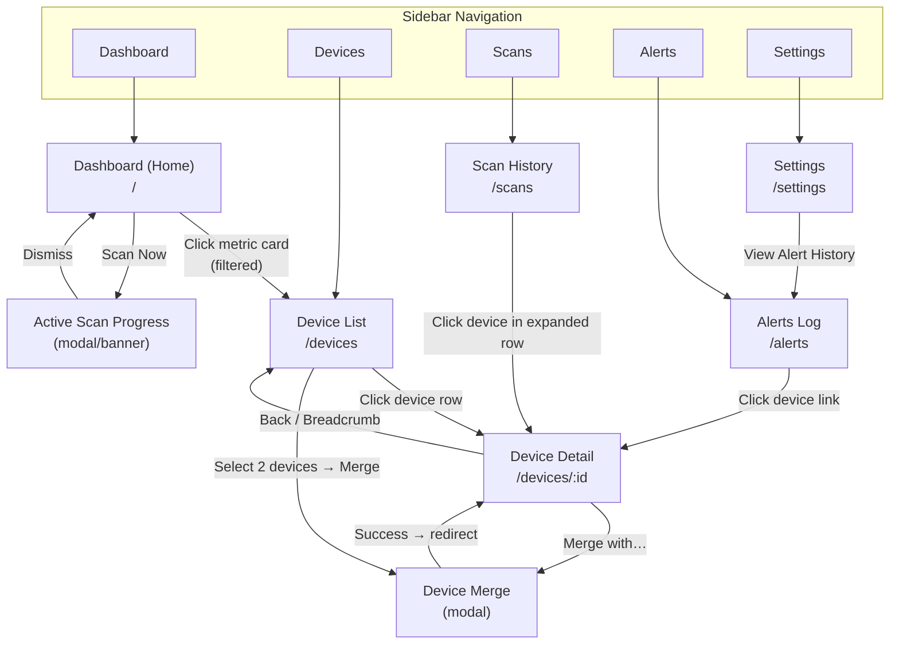

# Screen Map

## Screen Inventory

### 1. Dashboard (Home)

- **URL:** `/`
- **Purpose:** At-a-glance overview of network health, recent activity, and quick actions. Primary landing page for all user personas.
- **Navigation:** Default route; always accessible via logo/brand click or "Dashboard" in the sidebar/nav.
- **Key Elements:**
  - **Metric Cards:** Total Devices, New Devices (24h), Offline Devices, Last Scan (timestamp + status). Each card is clickable — navigates to the Device List with the corresponding filter pre-applied.
  - **Scan Progress Banner:** Appears inline when a scan is in progress. Shows % complete, devices found so far, elapsed time. Polls `GET /api/v1/scans/current` every 5 seconds.
  - **Recent Activity Feed:** Chronological list of recent events — new devices, status changes, port changes, scans completed. Shows the last 20 events.
  - **Network Summary Charts:** Device count over time (line chart, selectable range: 7d/30d/90d/1y), device type/vendor breakdown (donut chart).
  - **Quick Actions:** "Scan Now" button (with confirmation modal; disabled during active scan), "Export Devices" dropdown (CSV/JSON).
  - **Empty State:** When no scans have been run, displays a welcome message with a prominent "Run Your First Scan" call-to-action.
- **Actions:** Trigger manual scan, export device data, click metric cards to navigate to filtered device list, select chart time range.
- **Data Sources:**
  - `GET /api/v1/stats/overview` — metric card values
  - `GET /api/v1/scans/current` — active scan progress (polled)
  - `GET /api/v1/stats/charts/device-count` — device count time series
  - `GET /api/v1/stats/charts/device-types` — vendor/type breakdown
  - `POST /api/v1/scans` — manual scan trigger

---

### 2. Device List

- **URL:** `/devices`
- **Purpose:** Searchable, filterable, sortable table of all discovered devices. Primary workspace for device management, bulk operations, and exports.
- **Navigation:** Sidebar nav "Devices" link; metric card clicks from Dashboard arrive here with pre-applied filters (e.g., `/devices?status=offline`).
- **Key Elements:**
  - **Search Bar:** Full-text search across name, MAC, IP, hostname, vendor, tags. Client-side for ≤500 devices; server-side for larger datasets.
  - **Filter Bar:** Dropdowns/chips for Tag (multi-select, OR logic), Status (Online/Offline/All), Vendor (typeahead), First Seen date range picker. Filters are combinable (AND logic across categories).
  - **Device Table:** Columns — checkbox (for bulk select), Name/Hostname, MAC Address, Current IP, Vendor, Status (badge), Tags (chips), First Seen, Last Seen. Sortable by Name, IP, Vendor, First Seen, Last Seen, Status. Default sort: Last Seen descending.
  - **Bulk Actions Toolbar:** Appears when ≥1 device is selected. Actions: Add Tag, Remove Tag, Mark Known/Unknown. Shows count of selected devices.
  - **Export Buttons:** "Export CSV" and "Export JSON" buttons in the toolbar. Exports respect current filters.
  - **Pagination:** Client-side for ≤500 devices; server-side cursor-based pagination for larger datasets. Page size: 50 (configurable).
  - **Empty State:** "No devices found" with prompt to run first scan or adjust filters.
- **Actions:** Search, filter, sort, select devices, bulk tag/untag, mark known/unknown, export filtered data, click row to navigate to Device Detail.
- **Data Sources:**
  - `GET /api/v1/devices` — paginated device list with filter/sort query params
  - `GET /api/v1/tags` — tag list for filter dropdown
  - `POST /api/v1/devices/bulk-tag` — bulk tagging operations
  - `GET /api/v1/export/devices?format=csv|json` — export endpoints

---

### 3. Device Detail

- **URL:** `/devices/:id`
- **Purpose:** Complete view of a single device's identity, history, services, presence, and metadata. Investigation hub for security-conscious users.
- **Navigation:** Click any device row in the Device List. Back button or breadcrumb returns to Device List (preserving filters).
- **Key Elements:**
  - **Header:** Display name (editable inline), MAC address, vendor, status badge (Online/Offline), Known/Unknown flag (toggleable).
  - **Tab Bar:** Overview | History | Ports & Services | Presence | Tags & Notes
  - **Overview Tab:**
    - Identity card: Display name, MAC address, vendor (OUI), all hostnames observed, fingerprint confidence score, known/unknown flag.
    - Current IP address with first-seen/last-seen for that IP.
    - Quick stats: total IPs used, total ports observed, days since first seen.
  - **History Tab:**
    - IP History table: IP address, First Seen, Last Seen. Sorted by Last Seen descending. Paginated (20 rows, "Load more" for >100 entries).
    - Port Change Log: Chronological list of port open/close events with timestamps and service names.
  - **Ports & Services Tab:**
    - Current Open Ports table: Port number, Protocol (TCP/UDP), Service name, First detected, Last seen.
  - **Presence Tab:**
    - Timeline chart showing online/offline periods over a selectable date range (default: 30 days). Visual bar/Gantt-style chart.
    - Summary stats: uptime %, total online hours, longest continuous session.
  - **Tags & Notes Tab:**
    - Tag editor: Current tags as removable chips, typeahead input for adding tags (with suggested tags), bulk apply from tag list.
    - Notes editor: Freeform Markdown-compatible text area (max 4096 chars), auto-save on blur. Character count indicator.
  - **Actions Panel:** "Merge with…" button (opens Device Merge modal), "Delete" (if applicable), "Export Device History" (CSV).
- **Actions:** Edit display name, toggle known/unknown, switch tabs, add/remove tags, edit notes, initiate merge, export device history.
- **Data Sources:**
  - `GET /api/v1/devices/:id` — full device detail
  - `GET /api/v1/devices/:id/history` — IP changes, port changes, presence data (supports date range)
  - `PATCH /api/v1/devices/:id` — update display name, tags, notes, known flag
  - `POST /api/v1/devices/:id/merge` — merge identities
  - `GET /api/v1/tags` — tag suggestions for typeahead

---

### 4. Scan History

- **URL:** `/scans`
- **Purpose:** Chronological log of all past network scans with expandable detail rows. Allows users to understand what was discovered in each scan.
- **Navigation:** Sidebar nav "Scans" link.
- **Key Elements:**
  - **Scan List Table:** Columns — Start Time (local TZ), Duration, Status (badge: completed/failed/in-progress), Devices Found, New Devices, Errors. Sortable by Start Time. Default: most recent first.
  - **Expandable Rows:** Clicking a scan row expands it to show the per-device results: device name, MAC, IP, status change (new/ip_changed/port_changed/returned_online).
  - **Date Range Filter:** Date picker to narrow scan history by time period.
  - **Export Buttons:** "Export CSV" and "Export JSON" for scan results (respects date range filter).
  - **Pagination:** Server-side cursor-based pagination. Page size: 20.
  - **Active Scan Indicator:** If a scan is currently in progress, a highlighted row at the top shows real-time progress.
  - **Empty State:** "No scans recorded yet" with a "Scan Now" call-to-action.
- **Actions:** Browse scan history, expand rows for detail, filter by date range, export scan data, trigger new scan.
- **Data Sources:**
  - `GET /api/v1/scans` — paginated scan list with date range filter
  - `GET /api/v1/scans/:id` — expanded scan detail with per-device results
  - `GET /api/v1/scans/current` — active scan status
  - `GET /api/v1/export/scans?format=csv|json` — scan export
  - `POST /api/v1/scans` — trigger manual scan

---

### 5. Active Scan Progress

- **URL:** N/A (modal overlay or inline banner — not a standalone route)
- **Purpose:** Real-time feedback during an active network scan. Shows progress and intermediate results.
- **Navigation:** Appears automatically when a scan is in progress. Triggered by "Scan Now" button or detected on page load.
- **Key Elements:**
  - **Progress Bar:** Percentage complete (if deterministic) or indeterminate spinner.
  - **Stats:** Devices found so far, elapsed time, estimated time remaining (if available).
  - **Live Device Feed:** Scrollable list of devices being discovered in real time (most recent at top).
  - **Cancel/Dismiss:** Option to dismiss the modal (scan continues in background) or cancel the scan (if supported).
- **Actions:** Dismiss modal, view interim results.
- **Data Sources:**
  - `GET /api/v1/scans/current` — polled every 5 seconds

---

### 6. Settings

- **URL:** `/settings`
- **Purpose:** Application configuration for scanning, network, alerts, and API access.
- **Navigation:** Sidebar nav "Settings" link (bottom of nav, gear icon).
- **Key Elements:**
  - **Tab Bar:** General | Network | Alerts | API
  - **General Tab:**
    - Scan cadence: Dropdown or input for scan interval (e.g., every 15min, 30min, 1h, 6h, 12h, 24h, custom cron).
    - Scan intensity: Radio group — Light (ARP only), Standard (ARP + ICMP + common ports), Full (ARP + ICMP + full port scan).
    - Data retention: Input for retention period in days (default 365). Warning indicator below threshold.
    - Timezone display: Selector for dashboard timezone preference (defaults to browser).
  - **Network Tab:**
    - Subnet configuration: List of monitored subnets (CIDR notation). Add/edit/remove. Auto-detected subnets shown with override option.
    - Exclusion list: IP addresses or ranges to exclude from scanning.
  - **Alerts Tab:**
    - Alert triggers: Checkboxes for — New device detected, Device went offline, New open port detected, Scan failed.
    - Webhook URL: Input field for webhook endpoint (with "Test" button to verify).
    - Email configuration: SMTP server, port, from address, recipient(s). "Send Test Email" button.
    - Alert history link: Navigates to Alerts Log.
  - **API Tab:**
    - API key display: Masked by default, "Reveal" toggle, "Copy" button, "Regenerate" button (with confirmation — invalidates old key).
    - API documentation link: Opens `/api/v1/docs` in a new tab.
    - Rate limit info: Display current rate limit setting (100 req/min).
- **Actions:** Modify settings (auto-save or explicit save button per section), test webhook, send test email, regenerate API key.
- **Data Sources:**
  - Application configuration store (read/write via internal config API or direct settings endpoints)
  - `POST /api/v1/scans` (indirectly — settings affect scan behavior)

---

### 7. Device Merge

- **URL:** N/A (modal dialog — not a standalone route)
- **Purpose:** Merge two device identities that represent the same physical device (e.g., a device discovered via wired and wireless connections with different MACs).
- **Navigation:** Triggered from Device Detail "Merge with…" button. Also accessible from Device List bulk actions (when exactly 2 devices are selected).
- **Key Elements:**
  - **Source Device Card:** The device initiating the merge (read-only summary: name, MAC, vendor, tags).
  - **Target Device Selector:** Search/select the device to merge into. Typeahead with MAC/name/IP search. Shows preview card of selected target.
  - **Merge Preview:** Side-by-side comparison showing what will happen — tags combined, history merged, which name/MAC becomes primary.
  - **Confirmation:** Explicit "Merge" button with warning that the operation is significant. "Cancel" button.
  - **Result:** On success, redirects to the surviving device's detail page with a success toast.
- **Actions:** Select target device, preview merge result, confirm or cancel merge.
- **Data Sources:**
  - `GET /api/v1/devices` — search for merge target
  - `POST /api/v1/devices/:id/merge` — execute merge

---

### 8. Alerts Log

- **URL:** `/alerts`
- **Purpose:** History of all sent alert notifications with delivery status. Allows users to verify alerts are being delivered and debug failures.
- **Navigation:** Sidebar nav "Alerts" link; also accessible from Settings > Alerts tab via "View Alert History" link.
- **Key Elements:**
  - **Alert List Table:** Columns — Timestamp (local TZ), Alert Type (badge: new_device/offline/new_port/scan_failed), Device (link to Device Detail), Delivery Method (webhook/email), Status (badge: sent/failed/pending), Message preview.
  - **Filter Bar:** Filter by alert type, delivery status, date range.
  - **Detail Expansion:** Clicking a row expands to show full alert payload, delivery response (HTTP status for webhooks), and retry option for failed alerts.
  - **Empty State:** "No alerts sent yet" with link to Settings > Alerts to configure.
- **Actions:** Browse alert history, filter by type/status, expand for detail, retry failed alerts.
- **Data Sources:**
  - Internal alerts log storage (read via settings/alerts API)

---

## Navigation Flow

### Navigation Rules

1. **Persistent Sidebar:** Always visible on desktop/tablet. Contains: Dashboard, Devices, Scans, Alerts, Settings. Active page is highlighted.
2. **Breadcrumbs:** Shown on Device Detail (`Devices > Device Name`) and nested views. Preserve filter state when navigating back.
3. **Deep Linking:** All routed screens support direct URL access with query parameters for pre-applied filters (e.g., `/devices?tag=IoT&status=online`).
4. **Modal Context:** Modals (Merge, Scan Progress) overlay the current page without changing the URL. Dismissing returns to the underlying page.
5. **Responsive Collapse:** On tablet widths (768–1023px), the sidebar collapses to icons-only with a hamburger toggle. All screens stack vertically.
